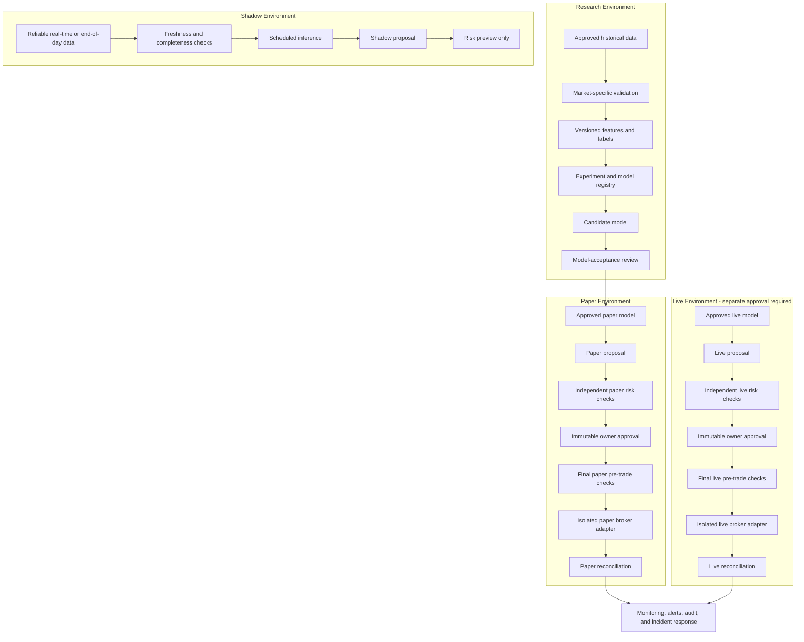

# Future Development Roadmap

This roadmap describes how the educational Version 1 SPY system could evolve over time.
It is planning documentation only. It does not approve live trading, does not implement
Version 2, and does not change the frozen Version 1.0.0 baseline.

Profitability is never guaranteed. Classification accuracy alone does not establish trading
safety. Any live-trading work requires a separate specification, separate review, and explicit
owner approval before implementation.

## Table of Contents

- [1. Executive Summary](#1-executive-summary)
- [2. Version 1 Baseline](#2-version-1-baseline)
- [3. Long-Term End State](#3-long-term-end-state)
- [4. Target Architecture](#4-target-architecture)
- [5. Development Stages](#5-development-stages)
- [6. Cross-Cutting Engineering Workstreams](#6-cross-cutting-engineering-workstreams)
- [7. Model-Acceptance Framework](#7-model-acceptance-framework)
- [8. Risk-Management Evolution](#8-risk-management-evolution)
- [9. Owner-Approval Design](#9-owner-approval-design)
- [10. Security Roadmap](#10-security-roadmap)
- [11. Legal, Regulatory, Tax, Broker, and Data-Licensing Considerations](#11-legal-regulatory-tax-broker-and-data-licensing-considerations)
- [12. Timeline and Staffing Estimates](#12-timeline-and-staffing-estimates)
- [13. Stage-Gate Checklist](#13-stage-gate-checklist)
- [14. Risk Register](#14-risk-register)
- [15. Explicitly Deferred Ideas](#15-explicitly-deferred-ideas)
- [16. Definition of Final Success](#16-definition-of-final-success)
- [17. Roadmap Governance and Change Log](#17-roadmap-governance-and-change-log)

## 1. Executive Summary

**Implemented:** Version 1.0.0 is an educational, SPY-only, daily, long-or-cash research and
paper-execution preparation system. It validates market-data contracts, engineers
leakage-safe features, trains deterministic baseline models, runs risk-controlled backtests,
persists audit artifacts in SQLite, exposes read-only FastAPI and Streamlit views, and
contains explicitly invoked Alpaca paper-only safeguards.

**Planned:** A responsible future path would first preserve Version 1, then establish a real
SPY research benchmark, then add stronger model research, shadow-mode operations, production
paper operation, and live-readiness engineering. Each step needs evidence, review, and
stage-gate approval.

**Exploratory:** Live SPY pilots, broader equity or ETF coverage, crypto, futures, foreign
exchange, options, and international equities are separate programs. The SPY model must not
be assumed to generalize to another asset, market, liquidity profile, session structure, tax
treatment, or broker workflow.

Required principles for all future work:

- Profitability is never guaranteed.
- Classification accuracy alone does not establish trading safety.
- Live trading requires a separate specification and explicit approval.
- Paper, shadow, and live environments remain isolated.
- Risk and execution remain separate from modeling.
- Owner approval binds to an exact immutable order.
- Every new asset and market requires separate research and validation.
- Missing or uncertain information always fails closed.
- Version 1 remains a reproducible frozen baseline.

## 2. Version 1 Baseline

**Implemented baseline:** Version 1.0.0 is frozen at tag `v1.0.0`. The tag dereferences to
commit `7798ce95193be2ce5778772e139933fac025bb32`. The current `main` branch used to create
this roadmap is `05c2e9c680b43174ed91cfbe198ba1842c291227`, which includes the Version 1
release plus a maintenance ignore-rule update for local test artifacts.

Version 1 includes:

- SPY ETF only.
- Daily OHLCV data only.
- Long-or-cash positions only.
- No short selling, leverage, margin, fractional-share orders, or additional markets.
- Provider-independent market-data contracts and validation.
- No committed real SPY dataset and no market-data downloader.
- Leakage-safe trailing features and the Version 1 open `t + 1` to open `t + 6` label.
- Chronological train, validation, and final-test split design.
- Deterministic logistic-regression and gradient-boosting baselines.
- Validation-only model selection and locked final-test diagnostics.
- Fixed long-or-cash signal policy.
- Risk-controlled backtesting with transaction costs and slippage.
- Explicit SQLite initialization and artifact persistence.
- Read-only FastAPI routes.
- Read-only Streamlit dashboard.
- Explicitly invoked Alpaca paper-only execution service with human approval,
  fingerprinting, dual kill switches, duplicate protection, same-session reservation, and
  lookup-only reconciliation.

Version 1 does not include:

- Live trading.
- Market-data downloading.
- Real-time data feeds.
- Automatic scheduling.
- Automatic order submission.
- API write routes.
- Dashboard execution controls.
- New markets or assets.
- Probability calibration, threshold optimization, hyperparameter tuning, or model artifact
  registry.
- Authentication, deployment hardening, or production operations.

The baseline is useful because it is narrow, reviewed, and reproducible. Future work should
compare against it instead of rewriting it casually.

## 3. Long-Term End State

**Planned target:** A secure, auditable, owner-approved research and trading platform could
eventually support market-specific research, real-time shadow proposals, production paper
operation, and carefully constrained live pilots.

The end-state flow is:

```text
Verified data
-> versioned market-specific model
-> proposal
-> independent risk checks
-> immutable owner approval
-> final pre-trade checks
-> isolated broker adapter
-> reconciliation
-> monitoring and audit
```

Success is defined by reproducibility, auditability, security, resilience, legal review,
risk control, and the ability to refuse trading. Success is not defined by a high accuracy
number, a single backtest, a paper-trading result, or a large number of supported markets.

## 4. Target Architecture

**Planned architecture:** Future architecture should extend Version 1's separation of
research, risk, execution, persistence, and presentation. Models should produce proposals or
scores only. They should not approve, size, submit, cancel, reconcile, or contact brokers.



Trust boundaries:

- Research, shadow, paper, and live environments must use separate configuration, credentials,
  databases or schemas, logs, and operational runbooks.
- Shadow mode may produce proposals but must not have submission capability.
- Paper mode may submit only to a verified paper endpoint after explicit approval.
- Live mode, if ever approved, must use a separate adapter and separate specification.
- Missing data, stale data, broker uncertainty, approval mismatch, unknown submission state,
  or database integrity failure must fail closed.

## 5. Development Stages

The stages below are ordered intentionally. Later stages should not start until earlier
evidence is reviewed. The estimates are planning ranges, not promises.

| Stage | Label | Objectives | Entry Criteria | Exit Criteria | Duration | Primary Risks | Required Evidence |
| --- | --- | --- | --- | --- | --- | --- | --- |
| 0 | Implemented maintenance baseline | Preserve Version 1 release reproducibility, dependency and warning audits, security fixes, and no performance claims. | Version 1.0.0 merged and tagged. | Tests, lint, type checks, docs, and safety audits remain clean after maintenance changes. | Ongoing maintenance. | Dependency drift, accidental scope expansion, stale docs. | Passing verification, changelog or review notes, no runtime behavior changes unless explicitly approved. |
| 1 | Planned real SPY research benchmark | Add approved historical provider workflow, frozen and checksummed real dataset, bull/bear/high-volatility/low-volatility periods, real train/validation/final-test evaluation, naive baselines, and cost/slippage sensitivity. No live execution. | Version 1 reproducibility preserved; provider and data-license review complete. | Benchmark report compares model results with majority-class, always-long, always-cash, and simple momentum baselines across regimes and costs. | 1-2 months. | Data licensing, overfitting, cost assumptions, benchmark leakage. | Dataset checksum, provider terms record, split specs, baseline metrics, sensitivity analysis, no broker submission path. |
| 2 | Planned model research Version 2 | Add walk-forward evaluation, feature research and ablation, hyperparameter search inside training/validation only, probability calibration, conservative threshold research, regime and drift analysis, experiment and model registry, and untouched final test. | Stage 1 dataset and baselines accepted. | Candidate model package has reproducible lineage and final-test report frozen after selection. | 2-4 months. | Final-test contamination, unstable improvements, poor calibration, excessive turnover. | Walk-forward report, ablation evidence, calibration diagnostics, threshold rationale, registry records, leakage tests. |
| 3 | Planned real-time shadow and production paper system | Add reliable ingestion, freshness controls, scheduled inference, shadow proposals with no submission capability, monitoring, alerts, production paper execution, reconciliation, and recovery runbooks. Require 3-6 months of observation. | Stage 2 model accepted for paper research; operations design approved. | Shadow and paper logs show stable operation, no uncontrolled warnings, no unexpected submissions, and reviewed reconciliation behavior. | 2-4 months development plus 3-6 months observation. | Data outages, scheduler defects, duplicate orders, alert fatigue, paper/live confusion. | Freshness logs, shadow proposal audit, paper runbook drills, reconciliation reports, monitoring evidence. |
| 4 | Planned live-readiness engineering | Draft separate live specification and adapter; add managed secrets, environment isolation, capital/daily loss/weekly loss/exposure/drawdown limits, emergency shutdown, security review, broker agreement review, legal/regulatory review, and incident drills. | Stage 3 observation accepted by owner and reviewers. | Live-readiness package is reviewed, tested in non-live environments, and explicitly approved or rejected. | 2-3 months after shadow validation. | Credential exposure, legal gaps, broker mismatch, unsafe limits, incident unpreparedness. | Signed-off specification, security review, legal notes, incident drill records, fail-closed tests. |
| 5 | Exploratory owner-approved live SPY pilot | SPY only, long-or-cash only, whole shares, no margin/leverage, one position, owner approval for every exact order, small approved risk budget, automatic stop on uncertainty, no unattended execution, observe for at least 3-6 months. | Stage 4 explicitly approved; live adapter exists only after approval. | Pilot either remains within limits with complete audit evidence or is stopped with documented lessons. | 3-6 months observation after approval. | Live slippage, approval fatigue, operational error, broker outage, tax implications. | Every order approval record, reconciliation, limit logs, incident reports, owner review. |
| 6 | Exploratory mature single-market platform | Add retraining governance, champion/challenger models, rollback, drift monitoring, backup and disaster recovery, security and incident maturity. | Stage 5 results reviewed without unresolved safety issues. | Single-market operations have mature controls and documented rollback/DR evidence. | Additional 6-12 months. | Model drift, registry errors, rollback failure, database loss. | Retraining policy, champion/challenger review, DR tests, drift dashboards, audit replay. |
| 7 | Exploratory limited ETF/equity universe | Add a small liquid approved universe, separate evidence per symbol, liquidity and spread controls, corporate actions, portfolio concentration/correlation, and cross-order concurrency. | Mature SPY process accepted; multi-symbol specification approved. | Each symbol has independent research evidence and portfolio controls pass shadow and paper validation. | 6-12 months. | Premature expansion, correlations, corporate actions, liquidity stress, concurrency bugs. | Per-symbol evidence, universe governance, correlation limits, liquidity reports, cross-order tests. |
| 8 | Exploratory separate asset-class programs | Evaluate crypto, futures, foreign exchange, options, and international equities as separate programs with market-specific data, calendars, labels, models, backtesting, liquidity, leverage/margin, settlement, execution, risk, legal review, and paper/shadow validation. | Separate asset-class specification and approval. | Each asset-class program is approved or rejected independently; no SPY model generalization assumption. | Market-specific; likely multi-year. | Wrong market assumptions, leverage, settlement, regulation, liquidity, tax, broker support. | Separate specs, legal review, data licenses, market-specific tests, shadow/paper evidence. |

### Stage 0 - Preserve Version 1

**Implemented maintenance posture:** Keep Version 1.0.0 reproducible. Run dependency and
warning audits, apply security fixes, keep documentation accurate, and avoid performance
claims. This stage is ongoing maintenance and must not broaden Version 1 scope.

### Stage 1 - Real SPY Research Benchmark

**Planned:** Select an approved historical provider and document licensing. Freeze and
checksum a real SPY dataset if the license permits local retention. Define market regimes
before analysis: bull, bear, high-volatility, and low-volatility periods. Run actual
train/validation/final-test evaluation against naive baselines:

- majority-class classifier
- always-long strategy
- always-cash strategy
- simple momentum strategy

The output should include cost and slippage sensitivity. No live execution is allowed in
this stage.

### Stage 2 - Model Research Version 2

**Planned:** Add walk-forward evaluation, feature research, ablation studies,
hyperparameter search within training/validation only, probability calibration, conservative
threshold research, regime analysis, drift analysis, and an experiment/model registry. The
final test remains untouched until model and threshold choices are fixed.

### Stage 3 - Real-Time Shadow and Production Paper System

**Planned:** Build reliable data ingestion, freshness controls, scheduled inference, and
shadow proposals that cannot submit orders. Add operational monitoring and alerts before
production paper execution. Paper execution requires reconciliation and recovery runbooks.
After development, require 3-6 months of observation before considering live-readiness work.

### Stage 4 - Live-Readiness Engineering

**Planned but not approved for implementation:** Create a separate live specification and
adapter only after explicit approval. Add managed secrets, environment isolation, capital
limits, daily and weekly loss limits, exposure limits, drawdown limits, emergency shutdown,
security review, broker agreement review, legal and regulatory review, and incident drills.

### Stage 5 - Small-Capital Owner-Approved Live SPY Pilot

**Exploratory and not approved:** A live pilot, if ever approved, should remain SPY only,
long-or-cash only, whole shares only, no margin or leverage, one position, owner approval for
every exact immutable order, a small approved risk budget, automatic stop on uncertainty, and
no unattended execution. Observe for at least 3-6 months.

### Stage 6 - Mature Single-Market Platform

**Exploratory:** Add retraining governance, champion/challenger models, rollback, drift
monitoring, backup and disaster recovery, and mature incident response around a single market
before expanding.

### Stage 7 - Limited ETF/Equity Universe

**Exploratory:** Expand only to a small liquid approved universe after separate evidence per
symbol. Add liquidity and spread controls, corporate-action handling, portfolio
concentration and correlation limits, and cross-order concurrency protection.

### Stage 8 - Separate Asset-Class Programs

**Exploratory:** Each asset class needs a separate program. Do not imply that the SPY model
generalizes to another market.

For each asset class, evaluate:

- data source, data rights, historical depth, revisions, and outages
- calendars, trading sessions, holidays, and timezones
- labels, forecast horizons, model families, and leakage risks
- backtesting assumptions and fill realism
- liquidity, spreads, fees, borrow, funding, and market impact
- leverage, margin, liquidation, and settlement
- broker execution semantics and order types
- trade, position, portfolio, model, data, broker, and operational risk
- legal, regulatory, tax, broker, and data-licensing review
- paper and shadow validation evidence

Asset-specific notes:

- **Crypto:** 24/7 sessions, exchange fragmentation, custody, wallet and key-management
  risks, unstable fees, outages, market manipulation risk, and jurisdiction-specific rules.
- **Futures:** Contract rolls, expirations, margin, tick values, leverage, overnight risk,
  exchange sessions, settlement, and regulatory requirements.
- **Foreign exchange:** Decentralized liquidity, rollover, swaps, broker-specific pricing,
  leverage, jurisdictional constraints, and session overlaps.
- **Options:** Greeks, volatility surfaces, assignment/exercise, expirations, spreads,
  liquidity, complex margin, and path-dependent risk.
- **International equities:** Local calendars, currencies, settlement cycles, withholding
  taxes, data rights, corporate actions, market structure, and broker availability.

## 6. Cross-Cutting Engineering Workstreams

**Planned workstreams** should advance only when stage gates justify them:

- Data governance: provider approvals, dataset versioning, checksums, retention policy,
  revision tracking, and licensing records.
- Experiment governance: immutable experiment IDs, dependency snapshots, model registry,
  feature registry, split registry, and review records.
- Testing: deterministic fixtures, leakage regression tests, no-network test gates,
  broker-simulation tests, property checks for accounting, and fail-closed safety tests.
- Operations: monitoring, alerting, runbooks, incident response, backup, restore, and
  disaster recovery.
- Security: managed secrets, least privilege, credential rotation, audit logging, redaction,
  environment isolation, and dependency vulnerability review.
- Documentation: stage-specific design docs, safety reviews, data cards, model cards,
  runbooks, release notes, and owner approval records.
- Governance: stage-gate reviews, owner approvals, change-control logs, and explicit
  rejection criteria.

## 7. Model-Acceptance Framework

No single required accuracy percentage should approve a model. A model is acceptable only
when evidence shows it:

- beats naive baselines on relevant diagnostics and strategy-level metrics
- is stable across walk-forward periods
- is reasonably calibrated for its intended threshold use
- works across multiple regimes, including adverse regimes
- survives worse cost and slippage assumptions
- has acceptable drawdown and turnover for the approved risk budget
- passes leakage tests
- has reproducible lineage for data, features, labels, splits, parameters, dependencies,
  code version, and random seeds
- remains subject to independent risk limits

Classification accuracy is only one diagnostic. It does not prove profitability, live
readiness, execution safety, calibration, or risk acceptability.

Recommended acceptance artifacts:

- data card for each dataset
- feature card for each feature set
- model card for each model candidate
- walk-forward report
- cost and slippage sensitivity report
- calibration report
- regime report
- drawdown and turnover report
- leakage test report
- final-test lock record
- owner decision record

## 8. Risk-Management Evolution

Risk controls should evolve by layer:

- Trade-level risk: instrument eligibility, side, quantity, order type, time in force,
  estimated costs, reference price, stale-signal checks, market-hours checks, and approval
  fingerprint matching.
- Position-level risk: current position, one-position rules, concentration, exposure,
  drawdown contribution, stop conditions, and liquidation constraints if ever approved.
- Portfolio-level risk: total exposure, cash, daily loss, weekly loss, correlation,
  concentration, open-order aggregation, and cross-symbol concurrency.
- Model risk: drift, calibration decay, unstable features, overfitting, regime mismatch,
  post-release degradation, and excessive turnover.
- Data risk: missing bars, late bars, revisions, calendar changes, stale feeds, vendor
  outages, symbol changes, and corporate actions.
- Broker risk: endpoint mismatch, account-type mismatch, outages, order-state ambiguity,
  duplicate client-order IDs, partial fills, rejected orders, and reconciliation gaps.
- Operational risk: scheduler defects, failed alerts, database corruption, credential
  exposure, approval fatigue, incident-response gaps, and rollback failure.

Future risk work should remain independent of modeling. A model score must never override a
risk rejection. Missing or uncertain information must always fail closed.

## 9. Owner-Approval Design

Owner approval should bind to an exact immutable order. Any safety-relevant change invalidates
approval and requires a new record.

An approval record should contain:

- instrument
- side
- quantity
- order type
- time in force
- reference price
- expected exposure
- estimated costs
- model version and diagnostic score
- strategy reason
- risk decisions
- current position and orders
- approval expiration
- signal ID
- client-order ID
- immutable fingerprint

Safety-relevant invalidation examples:

- changed quantity, side, symbol, order type, or time in force
- changed reference price beyond approved tolerance
- changed expected exposure or estimated costs
- changed current position or open orders
- changed model version, strategy version, or risk decision
- expired approval
- stale signal
- changed client-order ID, signal ID, or fingerprint
- missing broker, data, or database state

Approval should be deliberate and auditable. Unattended approval is deferred. Approval
fatigue is a real operational risk and must be monitored.

## 10. Security Roadmap

Security work should progress before any live-readiness claim:

- Separate paper, shadow, and live environment configuration.
- Use managed secrets rather than `.env` files for any production-like environment.
- Enforce least-privilege credentials and broker account permissions.
- Rotate credentials and document rotation evidence.
- Redact secrets, account identifiers, authorization headers, and private broker data from
  logs, dashboards, API responses, screenshots, and review files.
- Add dependency vulnerability review and upgrade runbooks.
- Add tamper-evident audit logs or signed records if operational scope grows.
- Add backup and restore procedures for audit databases.
- Add incident drills for broker outages, unknown submissions, duplicate order attempts,
  credential exposure, and database corruption.
- Add environment isolation tests proving paper and live configuration cannot cross.
- Add release gates for generated artifacts, private screenshots, database files, and
  secrets.

Live credentials, if ever approved, should never be usable from research notebooks,
model-training jobs, API read paths, dashboard rendering, or shadow proposal jobs.

## 11. Legal, Regulatory, Tax, Broker, and Data-Licensing Considerations

This repository does not provide legal, regulatory, tax, broker, or investment advice.
Before live trading or broader market expansion, the owner should obtain appropriate
professional review.

Review topics include:

- whether personal trading activity, automated systems, or third-party access triggers
  registration, reporting, suitability, or recordkeeping obligations
- tax treatment of trades, wash-sale considerations, mark-to-market issues, and jurisdiction
  specific rules
- broker account agreements, API terms, order-routing behavior, margin settings, account
  restrictions, and paper/live differences
- market-data provider licensing, redistribution limits, retention rights, derived-data
  rules, and screenshot/report constraints
- exchange rules, pattern day-trading constraints, short-sale rules, options permissions,
  futures permissions, crypto custody, and international market requirements
- data privacy, credential handling, audit retention, and incident notification duties

Paper performance should not be treated as live performance. Paper fills, latency, liquidity,
fees, borrow, margin, taxes, and outages can differ materially from live conditions.

## 12. Timeline and Staffing Estimates

Estimates depend on research evidence, data, broker support, security, legal requirements,
test results, review speed, and team capacity.

Solo part-time estimate:

- Owner-approved SPY pilot: about 10-18 months after Version 1.
- Mature single-market system: about 18-30 months.
- Responsible multi-market platform: about 3-5+ years.

Experienced full-time small team estimate:

- SPY pilot: about 6-10 months.
- Mature single-market platform: about 12-24 months.
- Multi-market expansion: about 2-4+ years.

These estimates assume each stage can be justified by evidence. A stage can be paused or
rejected indefinitely if research, safety, operational, legal, or broker evidence is weak.

## 13. Stage-Gate Checklist

Do not advance a stage until the relevant items are reviewed and recorded:

- [ ] Version 1 baseline remains reproducible or maintenance changes are documented.
- [ ] No uncontrolled warnings are present.
- [ ] Test, lint, format, type, and coverage gates pass.
- [ ] Data source, data rights, checksums, and retention policy are documented.
- [ ] Split specifications are frozen before final-test use.
- [ ] Naive baselines and cost/slippage sensitivity are complete.
- [ ] Leakage tests pass.
- [ ] Model lineage and experiment lineage are reproducible.
- [ ] Walk-forward evidence is stable enough for the intended stage.
- [ ] Calibration, drawdown, turnover, and regime diagnostics are reviewed.
- [ ] Risk limits are independent from model outputs.
- [ ] Paper, shadow, and live environments are isolated.
- [ ] Missing or uncertain state fails closed in tests.
- [ ] Owner approval records bind to exact immutable orders.
- [ ] Broker preflight, endpoint, account, clock, position, order, and reconciliation behavior
  are tested in the relevant non-live environment.
- [ ] Security review is complete for the stage.
- [ ] Legal, regulatory, tax, broker, and data-licensing review is complete where required.
- [ ] Runbooks and incident drills exist for the stage.
- [ ] Known limitations and stop conditions are visible to the owner.
- [ ] Future-stage functionality is not implemented without explicit scope approval.

## 14. Risk Register

Likelihood and impact are planning estimates, not measured Version 1 results.

| Risk | Likelihood | Impact | Mitigation | Closure Evidence |
| --- | --- | --- | --- | --- |
| Overfitting | High | High | Use walk-forward evaluation, ablations, simple baselines, conservative thresholds, and final-test locks. | Stable out-of-sample reports, rejected overfit candidates, model card review. |
| Lookahead leakage | Medium | High | Keep feature, label, split, and backtest alignment tests; prohibit centered windows and future columns. | Leakage test suite, code review, dataset lineage audit. |
| Data revisions | Medium | Medium | Store provider, download time, checksums, raw snapshots when licensed, and revision policy. | Dataset card, checksum history, revision comparison report. |
| Regime change | High | High | Evaluate bull, bear, high-volatility, and low-volatility periods; monitor drift. | Regime report, drift dashboard, stop-condition evidence. |
| Model drift | High | High | Add drift monitoring, champion/challenger review, retraining governance, and rollback. | Drift alerts, retraining approvals, rollback drill. |
| Poor calibration | Medium | High | Calibrate probabilities only within training/validation; validate calibration over walk-forward periods. | Calibration plots, Brier/log-loss report, threshold review. |
| Underestimated costs | High | High | Run cost and slippage sensitivity with adverse assumptions. | Sensitivity report, approved cost model, live or paper comparison notes. |
| Illiquidity | Medium | High | Use liquidity, spread, participation, and order-size limits; start with liquid instruments only. | Liquidity report, pre-trade checks, rejected low-liquidity examples. |
| Broker outage | Medium | High | Fail closed, monitor broker health, keep reconciliation and recovery runbooks. | Outage drill, broker-status alert test, no auto-resubmit proof. |
| Duplicate orders | Medium | High | Enforce unique signal/client-order IDs and symbol/session reservations. | Database constraints, concurrency tests, incident drill. |
| Uncertain submissions | Medium | High | Record `submission_unknown`, reserve IDs, reconcile by lookup only, and never auto-resubmit. | Unknown-submission tests, reconciliation runbook, audit records. |
| Concurrency races | Medium | High | Use durable reservations, transactions, locks where needed, and cross-order constraints. | Stress tests, transaction audit, race-condition review. |
| Credential exposure | Medium | High | Use managed secrets, redaction, least privilege, rotation, and secret scans. | Secret-scan logs, rotation records, redaction tests. |
| Database corruption | Medium | High | Use backups, schema validation, typed reconstruction, and restore drills. | Restore test, corruption tests, backup verification. |
| Regulatory change | Medium | High | Require periodic legal/regulatory review before live or market expansion. | Review notes, updated operating constraints, stage-gate record. |
| Owner approval fatigue | High | Medium | Keep approvals clear, rate-limit proposal volume, monitor skipped or rushed approvals. | Approval metrics, owner feedback, proposal throttling evidence. |
| Premature market expansion | High | High | Require separate evidence and approval per asset, symbol, and market. | Separate specs, rejected expansion requests, per-market evidence. |
| Treating paper performance as live performance | High | High | Document paper/live differences and require live-readiness review before any pilot. | Paper-to-live gap analysis, owner sign-off, no profitability claims. |

## 15. Explicitly Deferred Ideas

Each deferred idea requires a separate specification and explicit approval before
implementation:

- autonomous live trading
- unattended approval
- short selling
- leverage
- options
- futures
- crypto
- foreign exchange
- smart routing
- high-frequency trading
- reinforcement learning
- LLM-generated orders
- social sentiment trading
- managing third-party funds

These ideas are not approved by this roadmap. Some may remain permanently out of scope.

## 16. Definition of Final Success

The final successful platform would have:

- verified data
- versioned market-specific models
- reproducible proposal generation
- independent risk checks
- immutable owner approval
- final pre-trade checks
- isolated broker adapters
- reconciliation
- monitoring
- audit replay
- security controls
- legal and broker review records
- documented stop conditions

The system should be judged by reproducibility, auditability, security, resilience, legal
review, risk control, and the ability to refuse trading. It should not be judged by a high
accuracy number, isolated backtest result, paper account result, or number of supported
markets.

## 17. Roadmap Governance and Change Log

Roadmap governance:

- Treat this file as planning documentation, not implementation approval.
- Keep Version 1.0.0 as the frozen baseline for comparison.
- Require a separate design document before implementing any stage beyond maintenance.
- Require explicit owner approval before live trading, new markets, automation, deployment,
  or materially different risk assumptions.
- Record rejected ideas as well as accepted ones.
- Update the roadmap when evidence invalidates an assumption.
- Keep profitability, investment-advice, and real-money-readiness claims out of roadmap
  language unless separately reviewed and legally approved.

Change log:

| Date | Main SHA | Change |
| --- | --- | --- |
| 2026-08-04 | `05c2e9c680b43174ed91cfbe198ba1842c291227` | Initial long-term future-development roadmap created as documentation-only planning after Version 1.0.0 was merged and tagged. |
