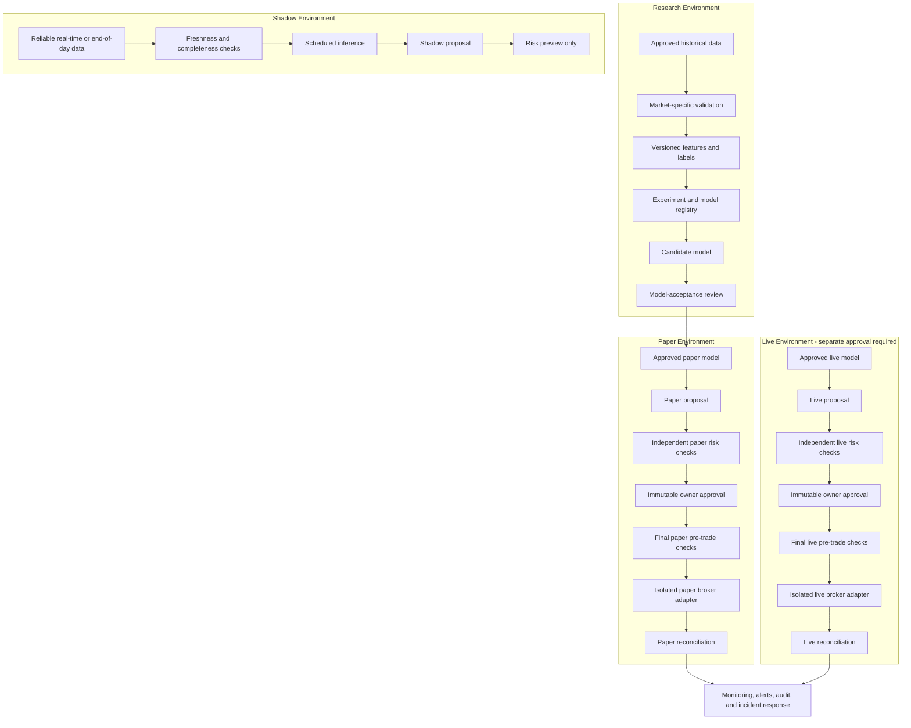

# Future Development Roadmap

This roadmap describes how the educational Version 1 SPY system could evolve over time.
It is planning and release-tracking documentation. It does not approve live trading, does not
authorize work outside the currently approved phase specifications, and does not change the
frozen Version 1.0.0 baseline.

Profitability is never guaranteed. Classification accuracy alone does not establish trading
safety. Any live-trading work requires a separate specification, separate review, and explicit
owner approval before implementation.

## Table of Contents

- [1. Executive Summary](#1-executive-summary)
- [2. Version 1 Baseline](#2-version-1-baseline)
- [3. Long-Term End State](#3-long-term-end-state)
- [4. Target Architecture](#4-target-architecture)
- [5. Development Stages](#5-development-stages)
- [Version 2 Phase and Release Map](#version-2-phase-and-release-map)
- [6. Cross-Cutting Engineering Workstreams](#6-cross-cutting-engineering-workstreams)
- [7. Model-Acceptance Framework](#7-model-acceptance-framework)
- [8. Risk-Management Evolution](#8-risk-management-evolution)
- [9. Owner-Approval Design](#9-owner-approval-design)
- [10. Security Roadmap](#10-security-roadmap)
- [11. Legal, Regulatory, Tax, Broker, and Data-Licensing Considerations](#11-legal-regulatory-tax-broker-and-data-licensing-considerations)
- [12. Timeline and Staffing Estimates](#12-timeline-and-staffing-estimates)
- [13. Stage-Gate Checklist](#13-stage-gate-checklist)
- [14. Risk Register](#14-risk-register)
- [15. Explicitly Deferred Ideas](#15-explicitly-deferred-ideas)
- [16. Definition of Final Success](#16-definition-of-final-success)
- [17. Roadmap Governance and Change Log](#17-roadmap-governance-and-change-log)

## 1. Executive Summary

**Implemented:** Version 1.0.0 is an educational, SPY-only, daily, long-or-cash research and
paper-execution preparation system. It validates market-data contracts, engineers
leakage-safe features, trains deterministic baseline models, runs risk-controlled backtests,
persists audit artifacts in SQLite, exposes read-only FastAPI and Streamlit views, and
contains explicitly invoked Alpaca paper-only safeguards.

**Active:** Version 2 Phase 4 Real-Time Shadow Mode is accepted and released as
`v2.0.0-beta.1`; the public tag points to
`1c8feae478c0f5536b2193eeb408e580f3f7e33c`. Version 2 Phase 5 Production Paper Operation
is active for specification plus non-submitting safety/recovery scaffold on
`review/v2-phase-05-production-paper`. Phase 5 infrastructure entry is authorized. Actual
Phase 5 broker submission remains blocked pending separate owner authorization, and
model-connected paper operation is `BLOCKED_NO_APPROVED_PAPER_MODEL` because Phase 3
produced `NO CANDIDATE PROMOTION`. Protected evaluation, strategy optimization, live
trading, broker communication through the new Phase 5 layer, unattended schedulers, API
write routes, and dashboard execution controls remain unauthorized. The package/runtime
version remains `2.0.0b1`; the public `v2.0.0-beta.2` tag does not exist.

**Planned:** A responsible future path preserves Version 1, uses the accepted real SPY
benchmark as baseline evidence, then adds stronger model research, shadow-mode operations,
production paper operation, and live-readiness engineering. Each step needs evidence,
review, and stage-gate approval.

**Exploratory:** Live SPY pilots, broader equity or ETF coverage, crypto, futures, foreign
exchange, options, and international equities are separate programs. The SPY model must not
be assumed to generalize to another asset, market, liquidity profile, session structure, tax
treatment, or broker workflow.

Required principles for all future work:

- Profitability is never guaranteed.
- Classification accuracy alone does not establish trading safety.
- Live trading requires a separate specification and explicit approval.
- Paper, shadow, and live environments remain isolated.
- Risk and execution remain separate from modeling.
- Owner approval binds to an exact immutable order.
- Every new asset and market requires separate research and validation.
- Missing or uncertain information always fails closed.
- Version 1 remains a reproducible frozen baseline.

## 2. Version 1 Baseline

**Implemented baseline:** Version 1.0.0 is frozen at tag `v1.0.0`. The tag dereferences to
commit `7798ce95193be2ce5778772e139933fac025bb32`. The initial roadmap branch was created
from base `main` commit `05c2e9c680b43174ed91cfbe198ba1842c291227`, which includes the
Version 1 release plus a maintenance ignore-rule update for local test artifacts.

Version 1 includes:

- SPY ETF only.
- Daily OHLCV data only.
- Long-or-cash positions only.
- No short selling, leverage, margin, fractional-share orders, or additional markets.
- Provider-independent market-data contracts and validation.
- No committed real SPY dataset and no market-data downloader.
- Leakage-safe trailing features and the Version 1 open `t + 1` to open `t + 6` label.
- Chronological train, validation, and final-test split design.
- Deterministic logistic-regression and gradient-boosting baselines.
- Validation-only model selection and locked final-test diagnostics.
- Fixed long-or-cash signal policy.
- Risk-controlled backtesting with transaction costs and slippage.
- Explicit SQLite initialization and artifact persistence.
- Read-only FastAPI routes.
- Read-only Streamlit dashboard.
- Explicitly invoked Alpaca paper-only execution service with human approval,
  fingerprinting, dual kill switches, duplicate protection, same-session reservation, and
  lookup-only reconciliation.

Version 1 does not include:

- Live trading.
- Market-data downloading.
- Real-time data feeds.
- Automatic scheduling.
- Automatic order submission.
- API write routes.
- Dashboard execution controls.
- New markets or assets.
- Probability calibration, threshold optimization, hyperparameter tuning, or model artifact
  registry.
- Authentication, deployment hardening, or production operations.

The baseline is useful because it is narrow, reviewed, and reproducible. Future work should
compare against it instead of rewriting it casually.

## 3. Long-Term End State

**Planned target:** A secure, auditable, owner-approved research and trading platform could
eventually support market-specific research, real-time shadow proposals, production paper
operation, and carefully constrained live pilots.

The end-state flow is:

```text
Verified data
-> versioned market-specific model
-> proposal
-> independent risk checks
-> immutable owner approval
-> final pre-trade checks
-> isolated broker adapter
-> reconciliation
-> monitoring and audit
```

Success is defined by reproducibility, auditability, security, resilience, legal review,
risk control, and the ability to refuse trading. Success is not defined by a high accuracy
number, a single backtest, a paper-trading result, or a large number of supported markets.

## 4. Target Architecture

**Planned architecture:** Future architecture should extend Version 1's separation of
research, risk, execution, persistence, and presentation. Models should produce proposals or
scores only. They should not approve, size, submit, cancel, reconcile, or contact brokers.



Trust boundaries:

- Research, shadow, paper, and live environments must use separate configuration, credentials,
  databases or schemas, logs, and operational runbooks.
- Shadow mode may produce proposals but must not have submission capability.
- Paper mode may submit only to a verified paper endpoint after explicit approval.
- Live mode, if ever approved, must use a separate adapter and separate specification.
- Missing data, stale data, broker uncertainty, approval mismatch, unknown submission state,
  or database integrity failure must fail closed.

## 5. Development Stages

The stages below are ordered intentionally. Later stages should not start until earlier
evidence is reviewed. The estimates are planning ranges, not promises.

| Stage | Status / Label | Objective | Entry Criteria | Exit Criteria | Duration | Major Risks | Required Evidence |
| --- | --- | --- | --- | --- | --- | --- | --- |
| 0 | Complete; preserved V1 baseline | Preserve V1 reproducibility and safety. | v1.0.0 merged and tagged. | Checks and safety audits stay clean. | Ongoing. | Dependency drift; scope creep; stale docs. | Passing verification; maintenance notes; no unapproved behavior change. |
| 1 | Planned real SPY benchmark | Build approved real SPY data and benchmark evidence. | V1 reproducible; provider and license reviewed. | Regime and naive-baseline report accepted. | 1-2 months. | Data licensing; leakage; weak baselines; cost assumptions. | Dataset checksum; provider record; split specs; baseline and sensitivity results. |
| 2 | Complete V2 Phase 3 Alpha 3 | Add walk-forward research framework, ablation policy, calibration policy, threshold policy, drift diagnostics, registry scaffolding, and owner-tested classification development evidence. | Stage 1 evidence accepted and Phase 2 benchmark released; PR #24 and PR #25 merged. | Phase 3 released as `v2.0.0-alpha.3` with `NO CANDIDATE PROMOTION`; no protected evaluation executed. | 2-4 months. | Final-test contamination; unstable gains; poor calibration; turnover. | Walk-forward report; ablations; calibration; drift/regime diagnostics; leakage tests; honest no-promotion decision. |
| 3 | Active V2 Phase 5 specification + non-submitting paper scaffold | Preserve released Phase 4 shadow evidence and define production paper-operation safety, recovery, reconciliation, and gate contracts without authorizing broker submission. | Phase 4 released as `v2.0.0-beta.1`; owner authorized Phase 5 infrastructure entry; no approved paper model exists. | Governing Phase 5 spec, recovery runbook, offline scaffold, tests, and safety audit accepted while broker submission and model-connected paper remain blocked. | Specification/scaffold first; later paper drills only if separately approved. | Duplicate orders; uncertain submission outcomes; credential exposure; accidental model or broker bypass. | Phase 5 gate tests; recovery matrix; no-resubmission evidence; static no-broker/no-credential/no-scheduler audit; existing execution regression tests. |
| 4 | Planned live-readiness engineering | Design separate live spec, controls, reviews, and incident drills. | Stage 3 observation accepted. | Live-readiness package approved or rejected. | 2-3 months after shadow validation. | Credential exposure; legal gaps; broker mismatch; unsafe limits. | Signed spec; security review; legal notes; incident drill evidence. |
| 5 | Exploratory live SPY pilot | Test small-capital owner-approved SPY-only live operation if separately approved. | Stage 4 explicitly approved. | Pilot evidence reviewed or pilot stopped with lessons. | At least 3-6 months observation. | Live slippage; approval fatigue; operational error; broker outage. | Exact approval records; reconciliation; limit logs; incident reports. |
| 6 | Exploratory mature single-market platform | Add retraining governance, champion/challenger, rollback, drift, and DR. | Stage 5 results reviewed. | Mature single-market controls accepted. | Additional 6-12 months. | Model drift; registry errors; rollback failure; data loss. | Retraining policy; challenger reviews; DR tests; drift dashboards. |
| 7 | Exploratory ETF/equity universe | Expand to a small liquid approved universe with per-symbol evidence. | Multi-symbol spec approved. | Each symbol and portfolio control passes review. | 6-12 months. | Premature expansion; correlation; corporate actions; concurrency. | Per-symbol evidence; universe governance; liquidity and correlation reports. |
| 8 | Exploratory asset-class programs | Evaluate crypto, futures, FX, options, and international equities separately. | Asset-class spec approved. | Each program is independently accepted or rejected. | Market-specific; likely multi-year. | Wrong assumptions; leverage; settlement; regulation; liquidity. | Separate specs; legal review; data licenses; market-specific shadow and paper evidence. |

### Stage 0 - Preserve Version 1

**Implemented maintenance posture:** Keep Version 1.0.0 reproducible. Run dependency and
warning audits, apply security fixes, keep documentation accurate, and avoid performance
claims. This stage is ongoing maintenance and must not broaden Version 1 scope.

### Stage 1 - Real SPY Research Benchmark

**Planned:** Select an approved historical provider and document licensing. Freeze and
checksum a real SPY dataset if the license permits local retention. Define market regimes
before analysis: bull, bear, high-volatility, and low-volatility periods. Run actual
train/validation/final-test evaluation against naive baselines:

- majority-class classifier
- always-long strategy
- always-cash strategy
- simple momentum strategy

The output should include cost and slippage sensitivity. No live execution is allowed in
this stage.

### Stage 2 - Model Research Version 2

**Complete as Version 2 Phase 3 Alpha 3:** Added walk-forward evaluation, feature research,
ablation studies, finite hyperparameter campaigns within training/development data only,
probability calibration, regime analysis, drift analysis, and an experiment/model registry.
PR #25 completed owner-tested, classification-first development research and produced
`NO CANDIDATE PROMOTION`. Alpha 3 recorded sanitized acceptance evidence without executing
protected evaluation, strategy-threshold optimization, shadow mode, paper operation, or live
trading. The already-opened Phase 2 final test remains frozen baseline evidence and must not
be used for later tuning.

### Stage 3 - Real-Time Shadow and Production Paper System

**Active as Version 2 Phase 5 specification + non-submitting safety/recovery scaffold:**
Phase 4 has been released as `v2.0.0-beta.1` after implementing manual verified-manifest
observation runs, reliable data-readiness policy, freshness/completeness controls,
deterministic scheduling policy functions, operator-triggered due-session resolution,
already-processed and recovery detection, missed-observation reporting, run identities,
durable idempotency, dedicated shadow SQLite audit state, monitoring events, local alerts,
and model-admission locks. Phase 5 now defines production paper-operation gates, recovery
policy, and offline scaffold. Actual Phase 5 broker submission requires separate
authorization, and model-connected paper operation is blocked because no approved paper
model exists. After any future model-connected shadow deployment, require observation
evidence before considering live-readiness work.

### Stage 4 - Live-Readiness Engineering

**Planned but not approved for implementation:** Create a separate live specification and
adapter only after explicit approval. Add managed secrets, environment isolation, capital
limits, daily and weekly loss limits, exposure limits, drawdown limits, emergency shutdown,
security review, broker agreement review, legal and regulatory review, and incident drills.

### Stage 5 - Small-Capital Owner-Approved Live SPY Pilot

**Exploratory and not approved:** A live pilot, if ever approved, should remain SPY only,
long-or-cash only, whole shares only, no margin or leverage, one position, owner approval for
every exact immutable order, a small approved risk budget, automatic stop on uncertainty, and
no unattended execution. Observe for at least 3-6 months.

### Stage 6 - Mature Single-Market Platform

**Exploratory:** Add retraining governance, champion/challenger models, rollback, drift
monitoring, backup and disaster recovery, and mature incident response around a single market
before expanding.

### Stage 7 - Limited ETF/Equity Universe

**Exploratory:** Expand only to a small liquid approved universe after separate evidence per
symbol. Add liquidity and spread controls, corporate-action handling, portfolio
concentration and correlation limits, and cross-order concurrency protection.

### Stage 8 - Separate Asset-Class Programs

**Exploratory:** Each asset class needs a separate program. Do not imply that the SPY model
generalizes to another market.

For each asset class, evaluate:

- data source, data rights, historical depth, revisions, and outages
- calendars, trading sessions, holidays, and timezones
- labels, forecast horizons, model families, and leakage risks
- backtesting assumptions and fill realism
- liquidity, spreads, fees, borrow, funding, and market impact
- leverage, margin, liquidation, and settlement
- broker execution semantics and order types
- trade, position, portfolio, model, data, broker, and operational risk
- legal, regulatory, tax, broker, and data-licensing review
- paper and shadow validation evidence

Asset-specific notes:

- **Crypto:** 24/7 sessions, exchange fragmentation, custody, wallet and key-management
  risks, unstable fees, outages, market manipulation risk, and jurisdiction-specific rules.
- **Futures:** Contract rolls, expirations, margin, tick values, leverage, overnight risk,
  exchange sessions, settlement, and regulatory requirements.
- **Foreign exchange:** Decentralized liquidity, rollover, swaps, broker-specific pricing,
  leverage, jurisdictional constraints, and session overlaps.
- **Options:** Greeks, volatility surfaces, assignment/exercise, expirations, spreads,
  liquidity, complex margin, and path-dependent risk.
- **International equities:** Local calendars, currencies, settlement cycles, withholding
  taxes, data rights, corporate actions, market structure, and broker availability.

## Version 2 Phase and Release Map

This map is planning-only release tracking. It does not implement further Version 2 work,
approve live trading, or change Version 1 runtime behavior.

Release meanings:

- `1.0.x` is reserved for Version 1 maintenance fixes.
- Alpha releases are research foundations.
- Beta begins with real-time shadow or production paper operation.
- RC means feature-complete and undergoing final audit.
- `v2.0.0` does not include real-money trading.
- Live-readiness and any live pilot remain later, separately approved roadmap stages.

Current tracking:

- `v1.0.0` remains the frozen stable baseline.
- V2 Phase 1 / `v2.0.0-alpha.1`: Accepted - Version 2 Real SPY Data Foundation.
- V2 Phase 2 / `v2.0.0-alpha.2`: Accepted and released - Real Historical Benchmark with
  owner-run real SIP benchmark completion.
- V2 Phase 3 / `v2.0.0-alpha.3`: Accepted and released - Walk-Forward Model Research.
  Scientific outcome: `NO CANDIDATE PROMOTION`.
- V2 Phase 4 / `v2.0.0-beta.1`: Accepted and released. Tag: `v2.0.0-beta.1`.
  Release commit: `1c8feae478c0f5536b2193eeb408e580f3f7e33c`.
  Gate B model-connected inference is blocked because no shadow model is approved.
- V2 Phase 5 / `v2.0.0-beta.2`: Production Paper Operation. Current substage:
  specification + non-submitting safety/recovery scaffold. Branch:
  `review/v2-phase-05-production-paper`. Phase 5 infrastructure entry is authorized.
  Actual Phase 5 broker submission is not yet authorized. Model-connected paper operation
  is blocked because no approved paper model exists.

| Track | Version | Name | Recommended Branch | Scope |
| --- | --- | --- | --- | --- |
| V1 baseline | `v1.0.0` | Frozen Version 1 baseline | Already tagged | Educational SPY daily research, backtesting, persistence, read-only API/dashboard, and explicit paper-only safeguards. |
| V2 Phase 1 | `v2.0.0-alpha.1` | Real SPY Data Foundation | `review/v2-phase-01-release-preparation` | Accepted - Version 2 Real SPY Data Foundation with approved provider workflow, licensing record, validated SPY dataset handling, checksums, and data lineage. |
| V2 Phase 2 | `v2.0.0-alpha.2` | Real Historical Benchmark | `review/v2-phase-02-release-preparation` | Accepted and released after owner-run real SIP benchmark, validation, one controlled final-test execution, benchmark verification, quality gates, and tag confirmation. No live execution or profitability claim. |
| V2 Phase 3 | `v2.0.0-alpha.3` | Walk-Forward Model Research | Merged and tagged | Accepted and released after PR #24 framework/scaffolding merge, PR #25 development implementation merge, owner development testing, and Alpha 3 release preparation. Outcome: `NO CANDIDATE PROMOTION`; no protected evaluation, strategy optimization, shadow inference, paper operation, or live trading. |
| V2 Phase 4 | `v2.0.0-beta.1` | Real-Time Shadow Mode | Merged and tagged | Accepted and released. PR #27, PR #28, PR #29, and PR #30 are merged; owner acceptance is complete; package/runtime version is `2.0.0b1`; public tag `v2.0.0-beta.1` points to `1c8feae478c0f5536b2193eeb408e580f3f7e33c`. Scope remains verified local Phase 1 manifests, latest completed XNYS target resolution, read-only schedule preview, run-due delegation to the observation runner, already-processed no-ops, recovery-required detection, missed-observation reporting, dedicated shadow SQLite audit persistence, and model-admission lock. Model-connected inference remains blocked until a separate approved model exists. |
| V2 Phase 5 | `v2.0.0-beta.2` | Production Paper Operation | `review/v2-phase-05-production-paper` | ACTIVE - specification + non-submitting safety/recovery scaffold. Phase 5 infrastructure entry is authorized. Actual Phase 5 broker submission is blocked pending separate owner authorization. Model-connected paper operation is blocked because no approved paper model exists. No beta.2 tag exists. |
| V2 Phase 6 | `v2.0.0-rc.1` | Version 2 Release Candidate | `review/v2-phase-06-release-candidate` | Feature-complete Version 2 audit for real-data, shadow, and production-paper scope. |
| Final | `v2.0.0` | Approved Real-Data, Shadow, and Production-Paper Platform | Release from approved RC | Version 2 release after final audit; excludes real-money trading and live pilot approval. |

The Phase 1 planning specification is
[Version 2 Phase 1 - Real SPY Data Foundation Specification](docs/V2_PHASE_01_REAL_SPY_DATA_SPEC.md).
It is accepted for `v2.0.0-alpha.1`. The Phase 2 governing specification is
[Version 2 Phase 2 - Real Historical Benchmark Specification](docs/V2_PHASE_02_REAL_HISTORICAL_BENCHMARK_SPEC.md).
Phase 2 implementation was merged through PR #20, and the owner-run feed, dataset,
validation, final-test, artifact-verification, and quality gates completed. The
`v2.0.0-alpha.2` release is complete; generated real benchmark artifacts and provider data
remain ignored and are not committed. The Phase 3 governing specification is
[Version 2 Phase 3 - Walk-Forward Model Research Specification](docs/V2_PHASE_03_WALK_FORWARD_RESEARCH_SPEC.md).
PR #24 merged its approved framework implementation and initial research scaffolding. PR #25
merged the manual, offline, development-only classification research runner, and owner
development testing completed locally. Alpha 3 release preparation was merged and tagged as
`v2.0.0-alpha.3`; it preserved the specification's leakage, lineage, fold, metric,
selection, protected-evaluation, and strategy-separation controls and recorded
`NO CANDIDATE PROMOTION`. The Phase 4 governing specification is
[Version 2 Phase 4 - Real-Time Shadow Mode Specification](docs/V2_PHASE_04_REAL_TIME_SHADOW_MODE_SPEC.md).
PR #27 merged the infrastructure-first shadow-mode scaffold, PR #28 merged Observation
Pipeline V1, PR #29 merged Scheduled Observation Operations V1, PR #30 merged Beta 1
release preparation, owner acceptance is complete, and `v2.0.0-beta.1` is released. The
Phase 5 governing specification is
[Version 2 Phase 5 - Production Paper Operation Specification](docs/V2_PHASE_05_PRODUCTION_PAPER_OPERATION_SPEC.md).
The current Phase 5 substage is specification plus non-submitting safety/recovery scaffold.

Phase 4 transition sequence:

```text
Phase 4 implementation
        |
        v
Phase 4 owner acceptance
        |
        v
Phase 4 Beta 1 release preparation
        |
        v
owner review + merge
        |
        v
post-merge tag approval
        |
        v
v2.0.0-beta.1
        |
        v
Phase 5 specification / Production Paper development
```

Recommended branch sequence:

- `review/v2-phase-01-real-spy-data`
- `review/v2-phase-02-real-benchmark`
- `review/v2-phase-03-walk-forward-research` (merged PR #24 framework/scaffolding)
- `review/v2-phase-03-development-research` (merged PR #25 development implementation)
- `review/v2-phase-03-alpha3-release-preparation` (merged and tagged as `v2.0.0-alpha.3`)
- `review/v2-phase-04-shadow-mode` (merged PR #27 specification/scaffold)
- `review/v2-phase-04-observation-pipeline` (merged PR #28 observation pipeline)
- `review/v2-phase-04-scheduled-observation-ops` (merged PR #29 scheduled observation operations)
- `review/v2-phase-04-beta1-release-preparation` (merged PR #30 and tagged as `v2.0.0-beta.1`)
- `review/v2-phase-05-production-paper` (active specification + non-submitting safety/recovery scaffold)
- `review/v2-phase-06-release-candidate`

## 6. Cross-Cutting Engineering Workstreams

**Planned workstreams** should advance only when stage gates justify them:

- Data governance: provider approvals, dataset versioning, checksums, retention policy,
  revision tracking, and licensing records.
- Experiment governance: immutable experiment IDs, dependency snapshots, model registry,
  feature registry, split registry, and review records.
- Testing: deterministic fixtures, leakage regression tests, no-network test gates,
  broker-simulation tests, property checks for accounting, and fail-closed safety tests.
- Operations: monitoring, alerting, runbooks, incident response, backup, restore, and
  disaster recovery.
- Security: managed secrets, least privilege, credential rotation, audit logging, redaction,
  environment isolation, and dependency vulnerability review.
- Documentation: stage-specific design docs, safety reviews, data cards, model cards,
  runbooks, release notes, and owner approval records.
- Governance: stage-gate reviews, owner approvals, change-control logs, and explicit
  rejection criteria.

## 7. Model-Acceptance Framework

No single required accuracy percentage should approve a model. A model is acceptable only
when evidence shows it:

- beats naive baselines on relevant diagnostics and strategy-level metrics
- is stable across walk-forward periods
- is reasonably calibrated for its intended threshold use
- works across multiple regimes, including adverse regimes
- survives worse cost and slippage assumptions
- has acceptable drawdown and turnover for the approved risk budget
- passes leakage tests
- has reproducible lineage for data, features, labels, splits, parameters, dependencies,
  code version, and random seeds
- remains subject to independent risk limits

Classification accuracy is only one diagnostic. It does not prove profitability, live
readiness, execution safety, calibration, or risk acceptability.

Recommended acceptance artifacts:

- data card for each dataset
- feature card for each feature set
- model card for each model candidate
- walk-forward report
- cost and slippage sensitivity report
- calibration report
- regime report
- drawdown and turnover report
- leakage test report
- final-test lock record
- owner decision record

## 8. Risk-Management Evolution

Risk controls should evolve by layer:

- Trade-level risk: instrument eligibility, side, quantity, order type, time in force,
  estimated costs, reference price, stale-signal checks, market-hours checks, and approval
  fingerprint matching.
- Position-level risk: current position, one-position rules, concentration, exposure,
  drawdown contribution, stop conditions, and liquidation constraints if ever approved.
- Portfolio-level risk: total exposure, cash, daily loss, weekly loss, correlation,
  concentration, open-order aggregation, and cross-symbol concurrency.
- Model risk: drift, calibration decay, unstable features, overfitting, regime mismatch,
  post-release degradation, and excessive turnover.
- Data risk: missing bars, late bars, revisions, calendar changes, stale feeds, vendor
  outages, symbol changes, and corporate actions.
- Broker risk: endpoint mismatch, account-type mismatch, outages, order-state ambiguity,
  duplicate client-order IDs, partial fills, rejected orders, and reconciliation gaps.
- Operational risk: scheduler defects, failed alerts, database corruption, credential
  exposure, approval fatigue, incident-response gaps, and rollback failure.

Future risk work should remain independent of modeling. A model score must never override a
risk rejection. Missing or uncertain information must always fail closed.

## 9. Owner-Approval Design

Owner approval should bind to an exact immutable order. Any safety-relevant change invalidates
approval and requires a new record.

An approval record should contain:

- instrument
- side
- quantity
- order type
- time in force
- reference price
- expected exposure
- estimated costs
- model version and diagnostic score
- strategy reason
- risk decisions
- current position and orders
- approval expiration
- signal ID
- client-order ID
- immutable fingerprint

Safety-relevant invalidation examples:

- changed quantity, side, symbol, order type, or time in force
- changed reference price beyond approved tolerance
- changed expected exposure or estimated costs
- changed current position or open orders
- changed model version, strategy version, or risk decision
- expired approval
- stale signal
- changed client-order ID, signal ID, or fingerprint
- missing broker, data, or database state

Approval should be deliberate and auditable. Unattended approval is deferred. Approval
fatigue is a real operational risk and must be monitored.

## 10. Security Roadmap

Security work should progress before any live-readiness claim:

- Separate paper, shadow, and live environment configuration.
- Use managed secrets rather than `.env` files for any production-like environment.
- Enforce least-privilege credentials and broker account permissions.
- Rotate credentials and document rotation evidence.
- Redact secrets, account identifiers, authorization headers, and private broker data from
  logs, dashboards, API responses, screenshots, and review files.
- Add dependency vulnerability review and upgrade runbooks.
- Add tamper-evident audit logs or signed records if operational scope grows.
- Add backup and restore procedures for audit databases.
- Add incident drills for broker outages, unknown submissions, duplicate order attempts,
  credential exposure, and database corruption.
- Add environment isolation tests proving paper and live configuration cannot cross.
- Add release gates for generated artifacts, private screenshots, database files, and
  secrets.

Live credentials, if ever approved, should never be usable from research notebooks,
model-training jobs, API read paths, dashboard rendering, or shadow proposal jobs.

## 11. Legal, Regulatory, Tax, Broker, and Data-Licensing Considerations

This repository does not provide legal, regulatory, tax, broker, or investment advice.
Before live trading or broader market expansion, the owner should obtain appropriate
professional review.

Review topics include:

- whether personal trading activity, automated systems, or third-party access triggers
  registration, reporting, suitability, or recordkeeping obligations
- tax treatment of trades, wash-sale considerations, mark-to-market issues, and jurisdiction
  specific rules
- broker account agreements, API terms, order-routing behavior, margin settings, account
  restrictions, and paper/live differences
- market-data provider licensing, redistribution limits, retention rights, derived-data
  rules, and screenshot/report constraints
- exchange rules, pattern day-trading constraints, short-sale rules, options permissions,
  futures permissions, crypto custody, and international market requirements
- data privacy, credential handling, audit retention, and incident notification duties

Paper performance should not be treated as live performance. Paper fills, latency, liquidity,
fees, borrow, margin, taxes, and outages can differ materially from live conditions.

## 12. Timeline and Staffing Estimates

Estimates depend on research evidence, data, broker support, security, legal requirements,
test results, review speed, and team capacity.

Solo part-time estimate:

- Owner-approved SPY pilot: about 10-18 months after Version 1.
- Mature single-market system: about 18-30 months.
- Responsible multi-market platform: about 3-5+ years.

Experienced full-time small team estimate:

- SPY pilot: about 6-10 months.
- Mature single-market platform: about 12-24 months.
- Multi-market expansion: about 2-4+ years.

These estimates assume each stage can be justified by evidence. A stage can be paused or
rejected indefinitely if research, safety, operational, legal, or broker evidence is weak.

## 13. Stage-Gate Checklist

Do not advance a stage until the relevant items are reviewed and recorded:

- [ ] Version 1 baseline remains reproducible or maintenance changes are documented.
- [ ] No uncontrolled warnings are present.
- [ ] Test, lint, format, type, and coverage gates pass.
- [ ] Data source, data rights, checksums, and retention policy are documented.
- [ ] Split specifications are frozen before final-test use.
- [ ] Naive baselines and cost/slippage sensitivity are complete.
- [ ] Leakage tests pass.
- [ ] Model lineage and experiment lineage are reproducible.
- [ ] Walk-forward evidence is stable enough for the intended stage.
- [ ] Calibration, drawdown, turnover, and regime diagnostics are reviewed.
- [ ] Risk limits are independent from model outputs.
- [ ] Paper, shadow, and live environments are isolated.
- [ ] Missing or uncertain state fails closed in tests.
- [ ] Owner approval records bind to exact immutable orders.
- [ ] Broker preflight, endpoint, account, clock, position, order, and reconciliation behavior
  are tested in the relevant non-live environment.
- [ ] Security review is complete for the stage.
- [ ] Legal, regulatory, tax, broker, and data-licensing review is complete where required.
- [ ] Runbooks and incident drills exist for the stage.
- [ ] Known limitations and stop conditions are visible to the owner.
- [ ] Future-stage functionality is not implemented without explicit scope approval.

## 14. Risk Register

Likelihood and impact are planning estimates, not measured Version 1 results.

| Risk | Likelihood | Impact | Mitigation | Closure Evidence |
| --- | --- | --- | --- | --- |
| Overfitting | High | High | Use walk-forward evaluation, ablations, simple baselines, conservative thresholds, and final-test locks. | Stable out-of-sample reports, rejected overfit candidates, model card review. |
| Lookahead leakage | Medium | High | Keep feature, label, split, and backtest alignment tests; prohibit centered windows and future columns. | Leakage test suite, code review, dataset lineage audit. |
| Data revisions | Medium | Medium | Store provider, download time, checksums, raw snapshots when licensed, and revision policy. | Dataset card, checksum history, revision comparison report. |
| Regime change | High | High | Evaluate bull, bear, high-volatility, and low-volatility periods; monitor drift. | Regime report, drift dashboard, stop-condition evidence. |
| Model drift | High | High | Add drift monitoring, champion/challenger review, retraining governance, and rollback. | Drift alerts, retraining approvals, rollback drill. |
| Poor calibration | Medium | High | Calibrate probabilities only within training/validation; validate calibration over walk-forward periods. | Calibration plots, Brier/log-loss report, threshold review. |
| Underestimated costs | High | High | Run cost and slippage sensitivity with adverse assumptions. | Sensitivity report, approved cost model, live or paper comparison notes. |
| Illiquidity | Medium | High | Use liquidity, spread, participation, and order-size limits; start with liquid instruments only. | Liquidity report, pre-trade checks, rejected low-liquidity examples. |
| Broker outage | Medium | High | Fail closed, monitor broker health, keep reconciliation and recovery runbooks. | Outage drill, broker-status alert test, no auto-resubmit proof. |
| Duplicate orders | Medium | High | Enforce unique signal/client-order IDs and symbol/session reservations. | Database constraints, concurrency tests, incident drill. |
| Uncertain submissions | Medium | High | Record `submission_unknown`, reserve IDs, reconcile by lookup only, and never auto-resubmit. | Unknown-submission tests, reconciliation runbook, audit records. |
| Concurrency races | Medium | High | Use durable reservations, transactions, locks where needed, and cross-order constraints. | Stress tests, transaction audit, race-condition review. |
| Credential exposure | Medium | High | Use managed secrets, redaction, least privilege, rotation, and secret scans. | Secret-scan logs, rotation records, redaction tests. |
| Database corruption | Medium | High | Use backups, schema validation, typed reconstruction, and restore drills. | Restore test, corruption tests, backup verification. |
| Regulatory change | Medium | High | Require periodic legal/regulatory review before live or market expansion. | Review notes, updated operating constraints, stage-gate record. |
| Owner approval fatigue | High | Medium | Keep approvals clear, rate-limit proposal volume, monitor skipped or rushed approvals. | Approval metrics, owner feedback, proposal throttling evidence. |
| Premature market expansion | High | High | Require separate evidence and approval per asset, symbol, and market. | Separate specs, rejected expansion requests, per-market evidence. |
| Treating paper performance as live performance | High | High | Document paper/live differences and require live-readiness review before any pilot. | Paper-to-live gap analysis, owner sign-off, no profitability claims. |

## 15. Explicitly Deferred Ideas

Each deferred idea requires a separate specification and explicit approval before
implementation:

- autonomous live trading
- unattended approval
- short selling
- leverage
- options
- futures
- crypto
- foreign exchange
- smart routing
- high-frequency trading
- reinforcement learning
- LLM-generated orders
- social sentiment trading
- managing third-party funds

These ideas are not approved by this roadmap. Some may remain permanently out of scope.

## 16. Definition of Final Success

The final successful platform would have:

- verified data
- versioned market-specific models
- reproducible proposal generation
- independent risk checks
- immutable owner approval
- final pre-trade checks
- isolated broker adapters
- reconciliation
- monitoring
- audit replay
- security controls
- legal and broker review records
- documented stop conditions

The system should be judged by reproducibility, auditability, security, resilience, legal
review, risk control, and the ability to refuse trading. It should not be judged by a high
accuracy number, isolated backtest result, paper account result, or number of supported
markets.

## 17. Roadmap Governance and Change Log

Roadmap governance:

- Treat this file as planning documentation, not implementation approval.
- Keep Version 1.0.0 as the frozen baseline for comparison.
- Require a separate design document before implementing any stage beyond maintenance.
- Require explicit owner approval before live trading, new markets, automation, deployment,
  or materially different risk assumptions.
- Record rejected ideas as well as accepted ones.
- Update the roadmap when evidence invalidates an assumption.
- Keep profitability, investment-advice, and real-money-readiness claims out of roadmap
  language unless separately reviewed and legally approved.

Related documents:

- [Project Specification](PROJECT_SPEC.md): frozen Version 1 implementation baseline.
- [Version 2 Phase 1 - Real SPY Data Foundation Specification](docs/V2_PHASE_01_REAL_SPY_DATA_SPEC.md):
  accepted specification for `v2.0.0-alpha.1`.
- [Version 2 Phase 2 - Real Historical Benchmark Specification](docs/V2_PHASE_02_REAL_HISTORICAL_BENCHMARK_SPEC.md):
  accepted governing specification for `v2.0.0-alpha.2`.
- [Version 2 Phase 3 - Walk-Forward Model Research Specification](docs/V2_PHASE_03_WALK_FORWARD_RESEARCH_SPEC.md):
  released governing specification for `v2.0.0-alpha.3` after PR #24
  framework/scaffolding merge, PR #25 development implementation merge, owner development
  testing, Alpha 3 release preparation, and tag confirmation.
- [Version 2 Phase 3 Alpha 3 Release Evidence](docs/V2_PHASE_03_ALPHA3_RELEASE_EVIDENCE.md):
  sanitized aggregate evidence for the owner-run development campaign and Alpha 3 release.
- [Version 2 Phase 4 - Real-Time Shadow Mode Specification](docs/V2_PHASE_04_REAL_TIME_SHADOW_MODE_SPEC.md):
  governing specification for owner-accepted and released `v2.0.0-beta.1`. Model-connected
  inference remains locked because no shadow model is approved.
- [Version 2 Phase 4 Beta 1 Release Evidence](docs/V2_PHASE_04_BETA1_RELEASE_EVIDENCE.md):
  sanitized owner acceptance and release evidence for `v2.0.0-beta.1`.
- [Version 2 Phase 5 - Production Paper Operation Specification](docs/V2_PHASE_05_PRODUCTION_PAPER_OPERATION_SPEC.md):
  active governing specification for target future release `v2.0.0-beta.2`.
- [Version 2 Phase 5 Paper Recovery Runbook](docs/V2_PHASE_05_PAPER_RECOVERY_RUNBOOK.md):
  non-submitting operator recovery guidance for uncertain paper attempts.
- [Version 2.0.0 Alpha 1 Release Notes](RELEASE_NOTES_V2.0.0_ALPHA_1.md): release notes
  for the `v2.0.0-alpha.1` release identifier.
- [Version 2.0.0 Alpha 2 Release Notes](RELEASE_NOTES_V2.0.0_ALPHA_2.md): release notes
  for the `v2.0.0-alpha.2` release identifier.
- [Version 2.0.0 Beta 1 Release Notes](RELEASE_NOTES_V2.0.0_BETA_1.md): release notes
  for the `v2.0.0-beta.1` release identifier.
- [Version 2 Phase 1 Release Checklist](VERSION_2_PHASE_01_RELEASE_CHECKLIST.md):
  release checklist and post-merge operator actions.
- [Version 2 Phase 2 Release Checklist](VERSION_2_PHASE_02_RELEASE_CHECKLIST.md):
  release checklist and post-merge operator actions.

Change log:

| Date | Base Main SHA | Change |
| --- | --- | --- |
| 2026-08-15 | `1c8feae478c0f5536b2193eeb408e580f3f7e33c` | Began V2 Phase 5 Production Paper Operation specification plus non-submitting safety/recovery scaffold on `review/v2-phase-05-production-paper` after Phase 4 Beta 1 was tagged as `v2.0.0-beta.1`; package/runtime remains `2.0.0b1`, target future release is `v2.0.0-beta.2`, Phase 5 infrastructure entry is authorized, actual Phase 5 broker submission remains separately gated, model-connected paper operation is blocked because no approved paper model exists, and no credentials, broker calls, paper orders, automatic retries, scheduler, model inference, protected evaluation, live trading, or beta.2 tag are authorized. |
| 2026-08-15 | `1c8feae478c0f5536b2193eeb408e580f3f7e33c` | Recorded that V2 Phase 4 Beta 1 release preparation merged through PR #30 and was tagged as `v2.0.0-beta.1`; release commit is `1c8feae478c0f5536b2193eeb408e580f3f7e33c`, package/runtime is `2.0.0b1`, Gate B remains locked, no shadow model is approved, protected evaluation was not executed, and Phase 5 paper submission remains separately gated. |
| 2026-08-15 | `6fb92c0a6f630d7faa3626cef515d0bb6c742951` | Began V2 Phase 4 Beta 1 release preparation on `review/v2-phase-04-beta1-release-preparation` after PR #29 merged and owner acceptance completed; package/runtime candidate is `2.0.0b1`, target release is `v2.0.0-beta.1`, the public tag remains pending, Gate B remains locked, and no model inference, broker behavior, market-data acquisition, unattended scheduler, Phase 5 paper operation, protected evaluation, or live trading is authorized. |
| 2026-08-11 | `10441e982e979a82fe060c717240e0e1086f707c` | Began V2 Phase 4 Scheduled Observation Operations V1 on `review/v2-phase-04-scheduled-observation-ops` after PR #28 merged; authorized deterministic latest completed XNYS target resolution, schedule preview, run-due delegation to the approved observation runner, already-processed no-ops, recovery-required handling, and missed-observation reporting while Gate B model-connected inference, unattended schedulers, acquisition, broker behavior, Phase 5 paper operation, protected evaluation, and live trading remain unauthorized. |
| 2026-08-11 | `d580d36a604121f3be0a137a60b6e9149d002566` | Began V2 Phase 4 Observation-Only Operational Pipeline V1 on `review/v2-phase-04-observation-pipeline` after PR #27 merged; authorized manual verified-manifest observation runs, dedicated shadow SQLite persistence, local monitoring/alerts, deterministic idempotency, and read-only inspection while Gate B model-connected inference, scheduling, broker behavior, Phase 5 paper operation, protected evaluation, and live trading remain unauthorized. |
| 2026-08-11 | `d68e9eed068115c9af7efeb9110d1afc175806bb` | Began V2 Phase 4 Real-Time Shadow Mode specification and infrastructure-first scaffold on `review/v2-phase-04-shadow-mode`; Gate A infrastructure entry is authorized, Gate B model-connected inference remains blocked because Phase 3 produced `NO CANDIDATE PROMOTION`, package/runtime version remains `2.0.0a3`, and no beta tag, Phase 5 paper operation, broker behavior, or live trading is authorized. |
| 2026-08-11 | `d68e9eed068115c9af7efeb9110d1afc175806bb` | Recorded that V2 Phase 3 Alpha 3 release preparation merged and was tagged as `v2.0.0-alpha.3`; the released scientific outcome is `NO CANDIDATE PROMOTION`, protected evaluation was not executed, and no model is approved for shadow or paper operation. |
| 2026-08-11 | `cc6ee4ee404659143a1ba633d3faf7fddbc63f9f` | Began V2 Phase 3 Alpha 3 release preparation on `review/v2-phase-03-alpha3-release-preparation` after PR #25 merge and owner-tested development campaign evidence; protected evaluation, Phase 4, strategy optimization, paper/live behavior, and the public `v2.0.0-alpha.3` tag remain unauthorized. |
| 2026-08-11 | `6933bff6f82b12c89d96f2ca1064d12a721ea43c` | Began V2 Phase 3 development-only walk-forward experimentation on `review/v2-phase-03-development-research`; protected evaluation, Phase 4, strategy optimization, and Phase 2 final-test tuning remain unauthorized. |
| 2026-08-10 | `c87df835e16a61b440a0c86d9c1bbfd43bbd5c13` | Began V2 Phase 3 walk-forward model-research framework implementation and initial scaffolding on `review/v2-phase-03-walk-forward-research`; Phase 2 final-test evidence remains frozen and unavailable for tuning. |
| 2026-08-09 | `1155c3c` | Recorded V2 Phase 2 engineering acceptance after PR #20 merge and owner-run real SIP benchmark completion. The benchmark showed weak predictive discrimination, motivating future Phase 3 walk-forward research without authorizing tuning on the already-opened Phase 2 final test. |
| 2026-08-05 | `8074ec1dbe738b67d288bf648b5cfc2126f4e76c` | Added the V2 Phase 2 Real Historical Benchmark specification for review; at that time implementation had not started, and no benchmark, profitability claim, or live-money capability was added. |
| 2026-08-05 | `c66d9e5ae7c99eeb7ab01e00a3c3494b2da1a7b0` | Recorded V2 Phase 1 acceptance for `v2.0.0-alpha.1`, owner-run smoke-test completion, and stable release metadata; at that time Phase 2 had not started and live-money trading remained outside Version 2.0.0. |
| 2026-08-04 | `0947c391b6c7646a27c1baeb7778cd229726bacb` | Added the Version 2 Phase 1 specification reference and clarified roadmap SHA metadata as base-main context; documentation-only planning with no Version 2 implementation. |
| 2026-08-04 | `05c2e9c680b43174ed91cfbe198ba1842c291227` | Refined the development-stage summary table and added Version 2 phase and release tracking; documentation-only planning with no implementation approval. |
| 2026-08-04 | `05c2e9c680b43174ed91cfbe198ba1842c291227` | Initial long-term future-development roadmap created as documentation-only planning after Version 1.0.0 was merged and tagged. |
