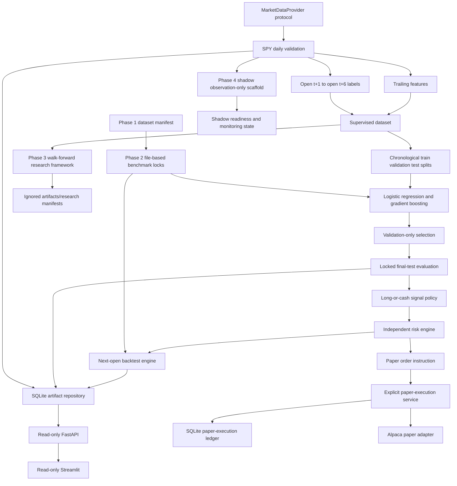
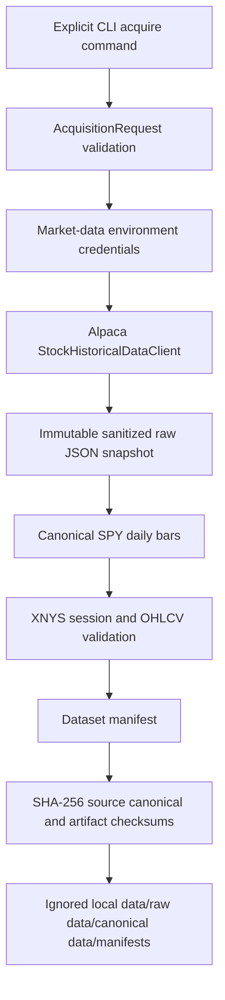
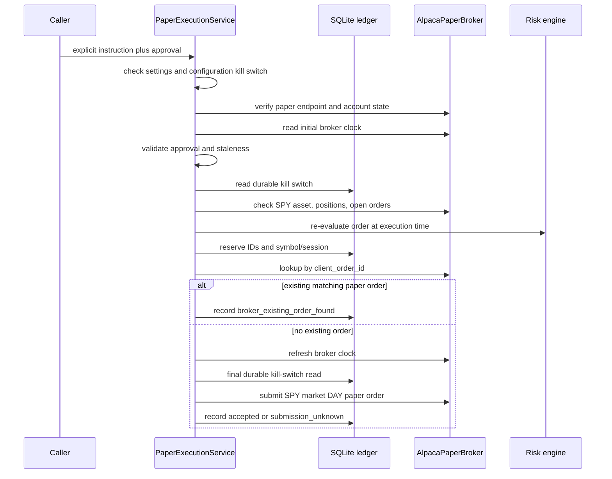

# Architecture

## System Overview

`spy-market-agent` is organized as a layered Version 1 research and paper-execution
system. Market data, feature engineering, modeling, strategies, risk, backtesting,
persistence, API presentation, dashboard rendering, and paper execution are separate
packages.

The central rule is that models produce diagnostics, not orders. Strategies convert locked
final-test probabilities into proposed long-or-cash targets, and every proposed order must
pass through independent risk checks before a backtest fill or an explicitly invoked paper
submission can proceed.

## Package Responsibilities

- `spy_market_agent.config` (`src/spy_market_agent/config`): typed settings, safe defaults, live-mode rejection, secret-safe
  display values, and explicit settings loading.
- `spy_market_agent.market_data` (`src/spy_market_agent/market_data`): SPY daily data contracts, provider protocol, XNYS calendar,
  deterministic dataset checksums, and the Version 2 Phase 1 explicit historical acquisition
  path for raw snapshots, canonical CSV, manifests, and local verification.
- `spy_market_agent.validation` (`src/spy_market_agent/validation`): canonical SPY daily OHLCV validation.
- `spy_market_agent.features` (`src/spy_market_agent/features`): leakage-safe trailing feature construction.
- `spy_market_agent.datasets` (`src/spy_market_agent/datasets`): forward label construction, feature/label alignment, and
  chronological train/validation/test partitions.
- `spy_market_agent.modeling` (`src/spy_market_agent/modeling`): deterministic logistic-regression and gradient-boosting
  candidates, validation-only selection, locked refit, and final-test diagnostics.
- `spy_market_agent.strategies` (`src/spy_market_agent/strategies`): fixed long-or-cash signal policy and next-session execution
  mapping.
- `spy_market_agent.risk` (`src/spy_market_agent/risk`): independent SPY-only, long-only risk evaluation.
- `spy_market_agent.backtesting` (`src/spy_market_agent/backtesting`): in-memory next-open backtest accounting, execution-price
  lineage, and metrics.
- `spy_market_agent.benchmark` (`src/spy_market_agent/benchmark`): Version 2 Phase 2
  file-based real historical benchmark workflow, immutable locks, final-test access
  controls, baseline/regime diagnostics, and artifact verification.
- `spy_market_agent.research` (`src/spy_market_agent/research`): Version 2 Phase 3
  walk-forward fold construction, leakage guards, experiment/feature/model registries,
  research metrics, baselines, candidate selection, protected-evaluation denial, and
  ignored artifact schemas.
- `spy_market_agent.shadow` (`src/spy_market_agent/shadow`): Version 2 Phase 4
  observation-only shadow operational pipeline for verified local Phase 1 manifests,
  deterministic shadow run identity, model-admission locks, freshness/schedule policy
  functions, dedicated shadow SQLite audit persistence, monitoring events, local alerts,
  and read-only inspection. It has no model-inference or order-submission capability.
- `spy_market_agent.persistence` (`src/spy_market_agent/persistence`): explicit SQLite initialization, schema validation, and
  artifact repositories.
- `spy_market_agent.api` (`src/spy_market_agent/api`): read-only FastAPI application and response service.
- `spy_market_agent.dashboard` (`src/spy_market_agent/dashboard`): read-only Streamlit dashboard and HTTP API client.
- `spy_market_agent.execution` (`src/spy_market_agent/execution`): broker-independent paper-execution models, approvals,
  fingerprinting, ledger repository, and service.
- `spy_market_agent.execution.alpaca_paper` (`src/spy_market_agent/execution/alpaca_paper.py`): isolated Alpaca paper-only adapter.

## Architecture Diagram

## Research Data Flow

1. A provider implementation returns SPY daily OHLCV data through the provider protocol.
2. Validation enforces canonical columns, XNYS sessions, chronological order, no duplicates,
   complete sessions, finite positive prices, and valid volume.
3. Feature engineering builds trailing features using only information available through
   session `t`.
4. Label construction uses entry at the open of `t + 1` and exit at the open of `t + 6`.
5. Supervised datasets keep feature columns separate from label audit columns.
6. Chronological partitions preserve order and keep labels inside each split boundary.
7. Candidate models train on train data only and are compared on validation data only.
8. The selected model is refit on train plus validation and evaluated once on the final test
   partition.

## Version 2 Phase 1 Acquisition Flow

**Accepted for alpha release preparation:** Phase 1 adds a separate explicit acquisition
path. It is not called by imports, tests, API startup, dashboard startup, model training,
backtesting, or paper execution.

The acquisition path uses `ALPACA_MARKET_DATA_API_KEY` and
`ALPACA_MARKET_DATA_SECRET_KEY`, not paper-trading credentials. It stores restricted provider
data only in ignored local directories. Synthetic fixtures under `data/fixtures/` are the
only Phase 1 market-data artifacts intended for Git.

Phase 1 still does not train a model, run a benchmark, contact the trading API, submit paper
orders, add API write routes, add dashboard controls, or enable live trading.

## Version 2 Phase 2 Benchmark Flow

**Engineering accepted for alpha release preparation:** Phase 2 adds a dedicated
`spy_market_agent.benchmark` package that accepts a verified Phase 1 manifest, not an
arbitrary CSV. It deep-verifies the raw, canonical, and manifest artifacts, reuses the
existing feature, label, model, signal, risk, and backtest logic, and writes ignored
immutable files under `artifacts/benchmarks/<benchmark_id>/`.

The benchmark workflow is split into locked stages:

1. `record-feed-decision` records owner-provided offline feed evidence without contacting
   Alpaca.
2. `prepare` verifies the Phase 1 dataset, checks eligibility, constructs features/labels,
   builds the deterministic chronological split, freezes cost/regime/model/baseline policy,
   and writes `benchmark_lock.json`.
3. `run-validation` trains only on training rows, evaluates only on validation rows, selects
   a model using the approved validation rule, and keeps final-test row-level labels guarded.
4. `finalize-lock` creates `final_test_lock.json` after validation artifacts are verified.
5. `run-final-test` requires explicit acknowledgement, writes `final_test_access.json`
   before loading final-test labels, refits on train plus validation only, and evaluates the
   locked final test once.
6. `verify` and audit replay perform offline checksum and lineage verification.

Phase 2 does not use SQLite for benchmark persistence, does not persist model binaries, does
not add model families, features, threshold tuning, API write routes, dashboard execution
controls, paper-execution behavior, real-time data, or live trading.

The owner-run real SIP benchmark completed under this flow for `v2.0.0-alpha.2` release
preparation. The engineering workflow passed, while the selected classifier showed weak
predictive discrimination and must not be described as a proven market edge.

## Version 2 Phase 3 Research Framework

**Released as `v2.0.0-alpha.3`:** Phase 3 PR #24 merged the approved framework and initial
research scaffolding. PR #25 merged the manual, offline, classification-first research
runner under `spy_market_agent.research`, owner development testing completed locally, and
Alpha 3 release preparation recorded sanitized evidence and package metadata under
`docs/V2_PHASE_03_WALK_FORWARD_RESEARCH_SPEC.md`. It starts from the completed Phase 2
benchmark evidence as sanitized baseline motivation only.

The default Phase 3 protocol is expanding-window walk-forward validation with chronological
assessment windows, a six-row boundary exclusion after each training window, explicit
feature warm-up handling, deterministic fold identities, deterministic experiment
identities, leakage validation, registry manifests, and ignored artifact schemas. The
framework separates classification diagnostics from strategy diagnostics and requires
experiment lineage before substantive real-data research. The development runner accepts
verified Phase 1 manifests, builds research-only OHLCV features without changing Version 1
feature contracts, reruns fixed Phase 2 baselines, evaluates finite scikit-learn candidate
grids, runs the predeclared calibration sub-study, and writes ignored research artifacts.
For accepted Phase 2 parent lineage, it reconstructs the frozen Phase 2 final-test
prediction-session boundary and truncates the development research slice before Version 1
labels are built.

Phase 3 does not introduce a production runtime package, API mutation path, dashboard
control, scheduler, broker connection, paper-execution change, live-execution behavior, or
new asset support. The Phase 3 CLI is manual, local, offline after data acquisition, and has
no acquisition or execution command. The already-opened Phase 2 final test remains frozen
evidence and must not be used for tuning. Protected evaluation, strategy optimization,
production paper operation, and live trading remain unauthorized. Phase 3 produced
`NO CANDIDATE PROMOTION`, so no model is approved for shadow or paper operation.

## Version 2 Phase 4 Observation-Only Shadow Pipeline

**Active observation-only operational pipeline development:** Phase 4 is governed by
`docs/V2_PHASE_04_REAL_TIME_SHADOW_MODE_SPEC.md` and targets `v2.0.0-beta.1`. The package
version remains `2.0.0a3` during this substage.

The initial `spy_market_agent.shadow` package is separate from research and execution:

1. `types.py` defines immutable shadow configuration, lineage, freshness, model-admission,
   monitoring, run decision, and proposal data structures.
2. `identity.py` derives deterministic shadow run IDs from stable session, mode, data
   lineage, feature schema, model metadata, and configuration inputs.
3. `model_gate.py` implements the fail-closed model-admission contract. The current state is
   `NO APPROVED SHADOW MODEL`.
4. `freshness.py` evaluates daily SPY/XNYS freshness and completeness decisions.
5. `schedule.py` exposes deterministic schedule eligibility functions without creating an
   OS scheduler, daemon, or background worker.
6. `policy.py` combines freshness and admission decisions for observation-only or future
   model-connected run eligibility.
7. `monitoring.py` summarizes health events as `healthy`, `degraded`, or `blocked`.
8. `persistence.py` owns a dedicated shadow SQLite schema, `spy-v2-phase4-shadow-db-v1`,
   with `shadow_schema_metadata`, `shadow_runs`, `shadow_input_snapshots`,
   `shadow_health_events`, and `shadow_alerts`.
9. `runner.py` orchestrates manual observation-only execution from verified Phase 1
   manifest, through target-session/freshness checks, durable reservation, health/alert
   writes, and terminal lifecycle update.
10. `cli.py` exposes `run-observation` and read-only `show-run`.

`observation_only_no_model` mode can report readiness and why inference is unavailable. It
consumes verified local Phase 1 manifests only and persists sanitized shadow audit state in
a separate SQLite database supplied explicitly by the operator. It cannot generate
predictions, produce model-based `LONG` or `CASH` proposals from real market data, create
`ShadowProposal` runtime outputs, submit paper orders, contact brokers, modify SQLite
paper-execution state, or run Phase 5 production paper behavior. `model_connected` mode
raises a model-admission error in this scaffold even when caller-supplied metadata
self-declares approval. A future
separately approved immutable model-admission registry or artifact is required before Gate B
can unlock.

## Backtest Data Flow

1. Locked final-test predictions produce fixed long-or-cash target positions.
2. Signals map to the next validated market-data row, not calendar-day arithmetic.
3. Proposed orders are generated only when the target changes.
4. Independent risk evaluation approves or rejects each proposed order.
5. Approved orders become fills with configured commission and slippage assumptions.
6. Rejected orders do not create fills and do not change portfolio state.
7. Backtest results retain source market data, execution prices, orders, decisions, fills,
   portfolio rows, metrics, schema versions, checksums, and runtime lineage.

## Paper-Execution Data Flow

Paper execution is not available through FastAPI or Streamlit. The service path is explicit,
requires a matching human approval, and keeps uncertainty as local audit state.

## Trust Boundaries

- Raw market data is untrusted until validation returns a canonical `MarketDataBatch`.
- Phase 1 provider data is untrusted until raw snapshot schema checks, canonicalization,
  XNYS validation, checksum construction, manifest validation, and safe storage all pass.
- Feature, label, model, strategy, backtest, and persistence objects revalidate lineage and
  schema invariants at their public boundaries.
- Phase 2 benchmark artifacts are untrusted until deterministic checksums, benchmark IDs,
  dataset IDs, schema versions, split lineage, and lock references are verified.
- Stage A benchmark services receive only training and validation row-level labels plus
  non-sensitive final-test boundary and aggregate eligibility counts.
- Phase 3 experiment artifacts are untrusted until dataset, feature, label, fold, model,
  calibration, threshold, metric, candidate-selection configuration, code, package, Python,
  and dependency lineage are verified.
- Phase 4 shadow inputs are untrusted until Phase 1 manifest verification, session,
  freshness, completeness, data-lineage, duplicate-run, and model-admission checks pass.
  Observation-only readiness is not model approval.
- Models cannot access brokers. The modeling package imports no execution adapter, no
  Alpaca SDK, and no broker protocol.
- The shadow package imports no execution adapter, paper service, order approval service,
  or Alpaca TradingClient.
- Alpaca trading-client usage is isolated to `execution/alpaca_paper.py`.
- Historical market-data SDK use is isolated to `market_data/alpaca_provider.py`, which uses
  the data API client and not the trading client.
- The API and dashboard are read-only. They inspect local persisted state and do not mutate
  SQLite, change kill switches, approve orders, reconcile orders, or submit broker requests.
- API and dashboard startup do not initialize or migrate databases.
- Package imports do not load settings globally, create files, train models, contact brokers,
  or submit orders.

## Initialization and Side Effects

SQLite setup is explicit through `initialize_database(...)`. Settings loading is explicit
through `load_settings()` or direct `Settings(...)` construction. The package import surface is
designed to be safe for tests, documentation tooling, API startup, and dashboard rendering.
Phase 2 benchmark commands are manually invoked CLI workflows; imports, API startup, and
dashboard startup do not read ignored benchmark artifacts or access final-test data.
Phase 3 research scaffolding must preserve the same import and startup behavior: no
automatic acquisition, model experimentation, artifact loading, broker construction, or
order submission.
Phase 4 shadow code also preserves side-effect-free imports: no scheduler startup, broker
construction, credential reads, data acquisition, model inference, artifact loading,
database migration, or order submission occurs on import. Shadow SQLite initialization and
run persistence occur only through explicit `run-observation` or repository calls and never
reuse the paper-execution ledger.
